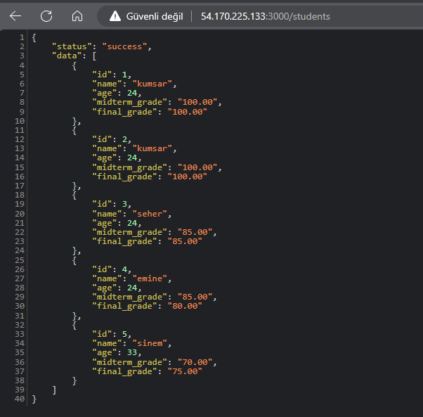
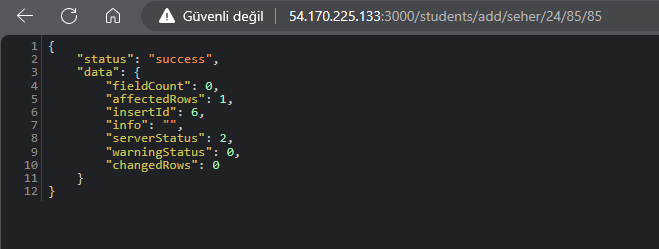
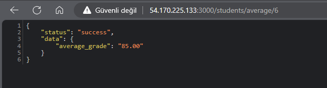
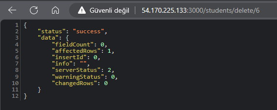

# Ada-Lovelace-DevOps-Akademisi
## Projeyi Sanal Makinede Kurma Adımları
`sudo apt-get update`

`sudo apt-get install -y ca-certificates curl gnupg`

`sudo mkdir -p /etc/apt/keyrings`

`curl -fsSL https://deb.nodesource.com/gpgkey/nodesource-repo.gpg.key | sudo gpg --dearmor -o /etc/apt/keyrings/nodesource.gpg`

`NODE_MAJOR=20`

`echo "deb [signed-by=/etc/apt/keyrings/nodesource.gpg] https://deb.nodesource.com/node_$NODE_MAJOR.x nodistro main" | sudo tee /etc/apt/sources.list.d/nodesource.list`

`sudo apt-get update`

`sudo apt-get install nodejs -y`

`node -v`

### Github SSH Key

`ssh-keygen -t rsa -m PEM`

`sudo cat ~/.ssh/id_rsa.pub`

`ssh-keyscan -t rsa github.com >> ~/.ssh/known_hosts`

## Projeyi Çalıştırma Adımları
- Veritabanını Query1.sql sorgusu ile lab-db veritabanı içerisinde oluşturun.
- `cd assigment1` komutu ile assigment1 klasörüne gidin.
- `npm install` komutu ile gerekli paketleri yükleyin.
- [mysql.js](./assigment1/helper/mysql.js) dosyasındaki AWS_RDD_PASSWORD parametresini .env dosyası içerisinde tanımlayın.
- `nodemon app.js` veya `npm start` komutu ile projeyi başlatın.
- Tarayıcıda `http://localhost:3000` adresine gidin.
- Öğrenci ekleme, silme ve listeleme işlemlerini gerçekleştirebilirsiniz.

    •	http://localhost:3000/students adresiyle tüm öğrenciler görüntülenir.

    •	http://localhost:3000/students/add/Emin/23/85/90 ile öğrencinin isim, yaş, midterm notu ve final notu bilgileri girilerek eklenir.

    •	http://localhost:3000/students sayfasına girilerek güncel liste görüntülenir. Görüntülenen liste içerisinde kayıtlı id lerden biri belirlenir. (Örneğin id:7)

    •	http://localhost:3000/students/average/7 adresine gidilerek 7 numaralı öğrencinin not ortalaması hesaplanır.

    •	http://localhost:3000/students/delete/7 adresine gidilerek 7 numaralı id silinebilir.

### Sanal Makinede Çalıştırma Adımları
`git clone git@github.com:SeherKumsar/07.04.2024-DevOps-Homework.git`

`cd 07.04.2024-DevOps-Homework`

`npm install`

`npm start`

- Tarayıcıda aws ile oluşturduğunuz api adresine gidin.
- Öğrenci ekleme, silme ve listeleme işlemlerini gerçekleştirebilirsiniz.

    •	http://54.170.225.133:3000/students adresiyle tüm öğrenciler görüntülenir.

    

    •	http://54.170.225.133:3000/students/add/seher/24/85/85 ile öğrencinin isim, yaş, midterm notu ve final notu bilgileri girilerek eklenir.

    

    •	http://54.170.225.133:3000/students sayfasına girilerek güncel liste görüntülenir. Görüntülenen liste içerisinde kayıtlı id lerden biri belirlenir. (Örneğin id:7)

    •	http://54.170.225.133:3000/students/average/7 adresine gidilerek 7 numaralı öğrencinin not ortalaması hesaplanır.

    

    •	http://54.170.225.133:3000/students/delete/7 adresine gidilerek 7 numaralı id silinebilir.
    
    
